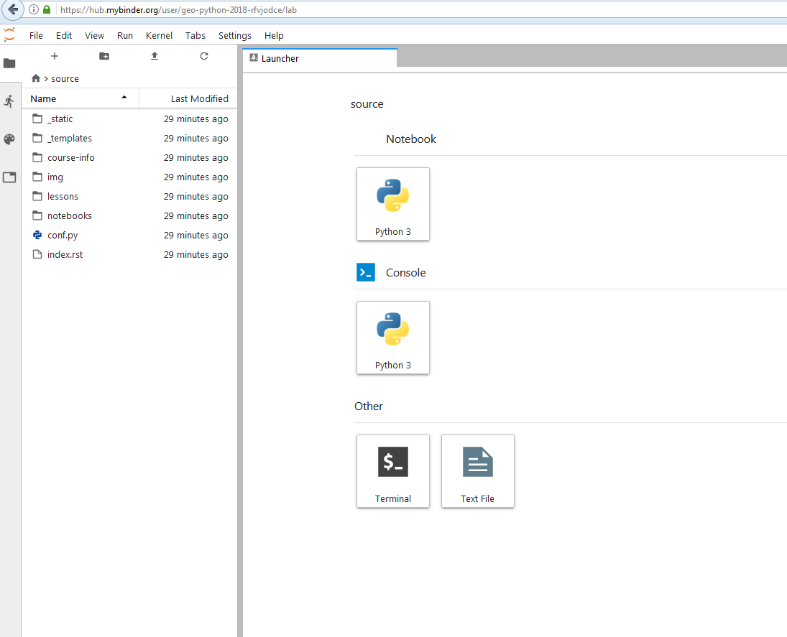
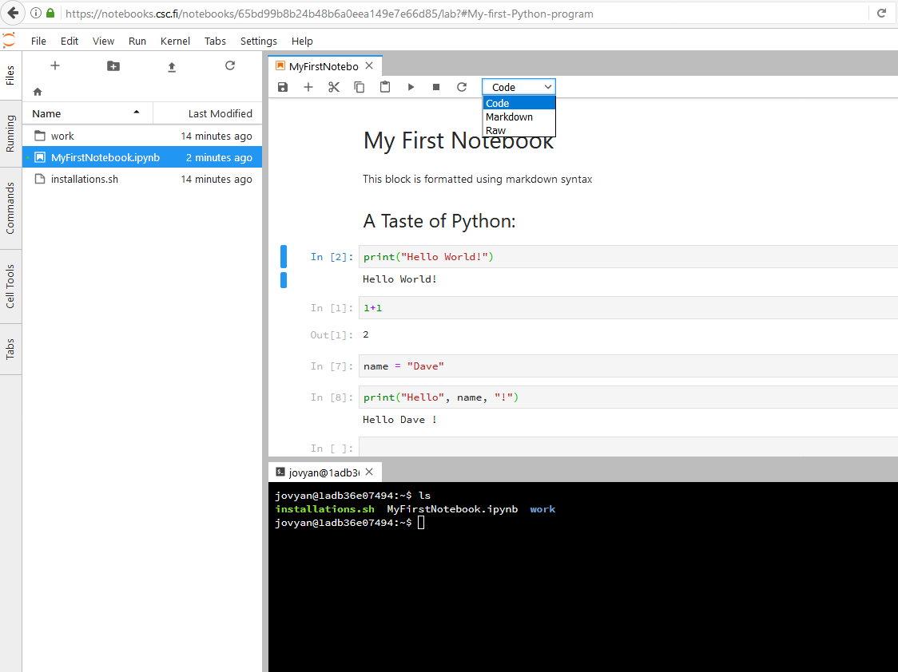
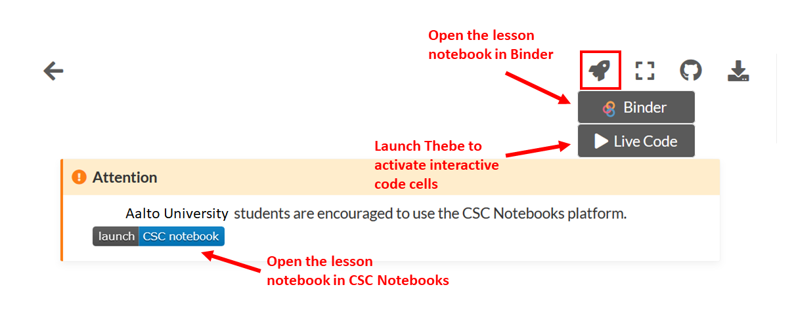
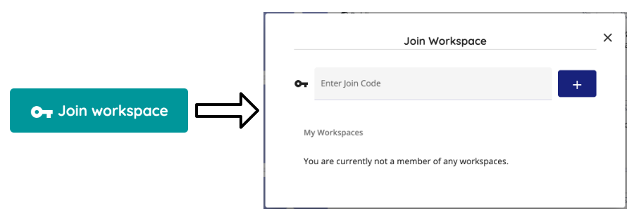
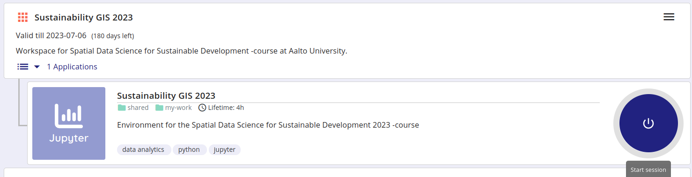
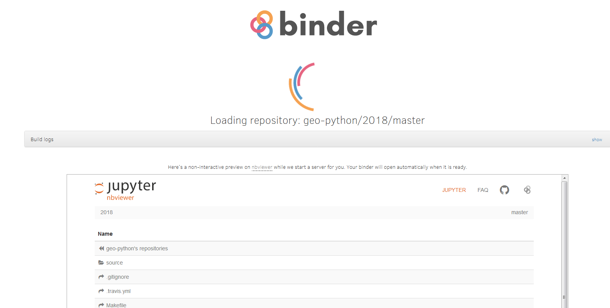

Course environment
==================

During this course, we will use different tools and applications for programming and communications:

1. `JupyterLab`_ for the actual programming
2. `Cloud computing environments`_ Binder or CSC Notebooks
3. `Git and GitHub`_ for version control and documentation
4. `Voting / polling  <#voting-and-polling>`_ for interactive questions during the lectures
5. `Slack`_ for communicating among Aalto students

JupyterLab
----------
`JupyterLab <https://jupyterlab.readthedocs.io/en/stable/getting_started/overview.html>`__ is an open-source web-based user interface for doing data science.
The JupyterLab interface consists of different components such as a file browser, terminal, image viewer, console, text editor, etc.

**Jupyter Notebooks** (filename extension ``.ipynb``) are documents inside the JupyterLab environment which contain computer code, and rich text elements (figures, links, etc.).
Jupyter Notebooks are perfect for documenting a data science workflow in an interactive format.

**We use JupyterLab/Jupyter Notebooks as the default programming environment during this course.**
All of the course materials are available in a JupyterLab setting via `cloud computing environments`_ (Binder or CSC Notebooks).

   Basic view of JupyterLab

   A Jupyter Notebook open in JupyterLab

Cloud computing environments
--------------------------------

We will use cloud-based computing environments (CSC Notebooks or Binder) to access interactive online version of the lessons
and to work on the weekly exercises. You can use the cloud computing environments with any computer as long as it has a reasonably fast internet connection and a web browser (just don't use Internet Explorer).

Please note that the cloud computing environments are **temporary**. Always remember to push your changes to GitHub (and / or download a local copy).

   Different options for making the lesson interactive

Each interactive lesson and exercise will have a launch button for both Binder and CSC Notebook.
The CSC notebooks environment is only accessible to students from Finnish universities and research institutes.

.. note::

    You can also install Python and the same programming environment to your local computer, but it is not necessary in this course (we recommend using the cloud computing environment.
    **However**, if you wish to do so, please read :doc:`this documentation <installing-miniconda>` to learn how to install Python and the libraries on your own computer.

CSC Notebooks
~~~~~~~~~~~~~~~

Notebooks by CSC (https://notebooks.csc.fi) is a computing environment hosted by the Finnish IT Center for Science (CSC). CSC notebooks are used for running Jupyter Notebooks in a customized cloud computing environment.
CSC Notebooks is available only for students who are affiliated with Finnish universities and research institutes (via the HAKA user authentication).

.. note:: **When using the CSC Notebooks for the first time, you need to join the group created for this course:**

    1. Log in at https://notebooks.csc.fi/
    2. Select Haka for the authentication provider
    3. Enter your Finnish university login credentials
    4. Click on the **Join workspace** button on the top right
    5. Join the ``Sustainability GIS 2024`` workspace using the join code ``sus-ttyngu9m``

    After joining the group, you should be able to view an environment called ``Sustainability GIS 2024`` on the Dashboard.

**Remember to save your work!**

.. note:: **Repeat these steps every time when starting to work on a programming task using the CSC Notebooks:**

    1. Log in at https://notebooks.csc.fi/
    2. Click ``Start session`` (power button) on the Dashboard for Sustainability GIS 2024
    3. Wait. It might take a few moments for the instance to launch

   Launching the instance takes a few moments.

**Remember to save your work!**

Binder
~~~~~~~

Binder (https://mybinder.org/) runs Jupyter Notebooks in your web browser in a customized environment. The original files (notebooks) are hosted on GitHub.
Binder does not require the user to log in, you can just click on the link in the lesson / exercise and start working.

   Binder takes a few moments to load

Once the instance is ready, you can navigate to the lesson folders and start working with existing notebooks or create a new one.

**Remember to save your work! The Binder instance is temporary, and all your files will be lost after the session.**

Git and GitHub
---------------

One of the core goals of this course (besides learning programming)
is to learn how to use `version control <https://en.wikipedia.org/wiki/Version_control>`__ with
`Git <https://en.wikipedia.org/wiki/Git_(software)>`__ and storing your
codes (privately) on `GitHub <https://github.com/>`__.

`Git <https://en.wikipedia.org/wiki/Git_(software)>`__ is a version
control software (developed by a rather famous Finn named Linus
Torvalds - he also created Linux!) that is used to track and store
changes in your files (often source code for programs) without losing
the history of past changes. Files in Git are stored in a repository,
which you can simply think of as a directory containing files (or other
directories) related to a single 'project'. Git is widely used by
professionals to keep track of what they’ve done and to collaborate with
other people.

`GitHub <https://github.com/>`__ is a web based Git repository hosting
service and social network. It is the largest online storage space of
collaborative works that exists in the world. It is a place where you
can share your code openly to the entire world or alternatively only to
your collaborators working on the same project. GitHub provides a nice
web-interface to your files that is easy to use. It is a nice way for
exploring the codes and documentation or e.g., teaching materials such
as those in our course.

Both Git and GitHub provide many more features than the ones mentioned
here, but for now we are happy to understand the basic idea of what they
are.

Voting and polling
------------------

During the lectures we will ask you questions by using an easy-to-use polling-system and show you the results in real-time.
You can access the polling system of our course from `presemo.aalto.fi/sds <https://presemo.aalto.fi/sds/>`__

.. note::

    The polling system is active only **during** the lessons. If you access the website outside the lecture times, you
    will most probably see only a white page without any content.

Slack
------

During the course we will use actively an application called `Slack <http://slack.com>`__ for discussion and
questions about the lessons and exercises. All enrolled students have received an invite link to the ``AaltoSDS2023`` workspace at the start of the course.
:doc:`If Slack is new to you, check Slack basic usage instructions <slack-usage>`.

Page summary
------------

Now you should have (at least) a basic idea about the different
components of our course environment and what they mean. You don't need
to understand everything fully at this point as they will become clearer
when we start using the course environment.