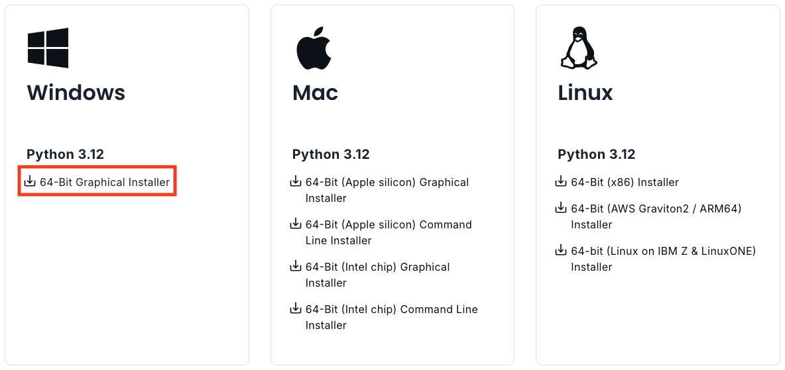
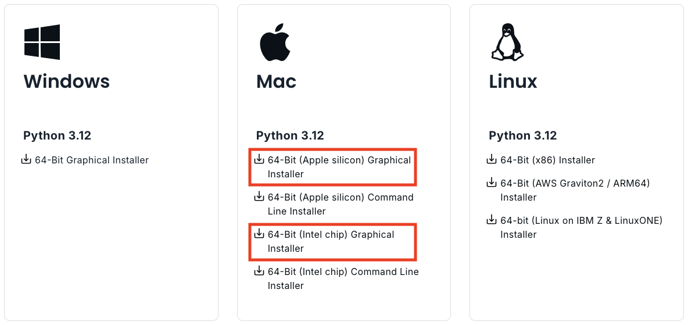

Install Python + libraries (optional)
=====================================

Although we will use the dedicated `course environment to do all the programming, <course-environment-components.html>`__
**it is also possible to complete the tutorials and programming exercises on your own computer**.
The purpose of this page is to help you to install Python and required Python packages locally.
We recommend using `Miniconda <https://docs.conda.io/en/latest/miniconda.html>`_ for installing Python
(i.e. not the one available from the Python website).
Miniconda comes with Python and a small number of useful packages. Additional packages can be installed using the
package management system `conda <https://docs.conda.io/en/latest/>`__.

Miniconda is a light-weight version of `Anaconda <https://www.anaconda.com/>`_ which is an open source distribution of the Python and R programming
languages for large-scale data processing, predictive analytics, and scientific computing, that aims to simplify package management and deployment. In short,
it makes life much easier when installing new tools to your Python.

In case you already have Anaconda installed on your computer, you can continue using that during the course without a problem.
**If you are new to Python and have not yet installed anything, we recommend you to start by**
`installing Miniconda <https://docs.conda.io/en/latest/miniconda.html>`__.

.. admonition:: Is it necessary to install software?

    No! You can also complete the course without installing anything on your own computer.
    Each lesson contains a launch button for running the code **interactively in the browser** without
    a need to install anything.

Install Miniconda
-------------------

You can find the latest version of Miniconda for different operating systems in the `Miniconda download page <https://docs.conda.io/en/latest/miniconda.html>`__.
Tips and tricks for Windows, macOS and Linux users below.

Windows
~~~~~~~~

Visit the `Miniconda download page <https://www.anaconda.com/download/success#miniconda>`__ and download the latest
**Miniconda3 Windows 64-bit** installer for Windows.

Install Miniconda to your computer by double clicking the installer and install it into a directory you want (you might need admin rights).
Install it to **all users** and use default settings.

After the installation is completed, test that the package manager ``conda`` works by
`opening a command prompt as a admin user <http://www.howtogeek.com/194041/how-to-open-the-command-prompt-as-administrator-in-windows-8.1/>`_
and running command ``conda --version``. If the command returns a version number of conda (e.g. ``conda 4.5.9``) everything is working correctly.

macOS
~~~~~~~~
Visit the `Miniconda download page <https://www.anaconda.com/download/success#miniconda>`__ and download the latest
Python installer for macOSX. If your computer is using an Apple silicon processor (e.g., M1, M2, M3, M4) you should select the Apple Silicon installer, and if your computer has an Intel processor then select the Intel chip installer.

Linux
~~~~~~~~

Install Miniconda 3 and add it to system path using Terminal:

.. code-block::

    # Download and install miniconda (first
    sudo wget https://repo.anaconda.com/miniconda/Miniconda3-latest-Linux-x86_64.sh
    sudo bash Miniconda3-latest-Linux-x86_64.sh

    # Add miniconda installation permanently to PATH variable
    nano ~/.bashrc

    # Add following line at the end of the file and save (EDIT ACCORDING YOUR INSTALLATION PATH)
    export PATH=$PATH:/PATH_TO_MINICONDA/miniconda3/bin:/PATH_TO_MINICONDA/miniconda3/lib/python3.9/site-packages

Install the course environment
------------------------------

Installing various GIS packages in Python can be sometimes a bit tricky due to various dependencies
between the packages. Sometimes an older version of the package, or even an older Python version might be required for a
specific tool to work. The recommended way to get the installation working smoothly is to **create a dedicated
Python environment** for the selected Python packages (e.g. for the ones used during this course).
A python environment is a separate installation including all required libraries as well as
the Python interpreter. It is a good practice to install all packages (if possible) from the same
conda channel (e.g. ``conda-forge`` which we recommend), and not to mix conda and pip for installations
if not strictly necessary.

**Installing the** ``sustainability-gis`` **environment for the course**

Conda/Mamba has an excellent documentation about `creating and managing conda environments <https://docs.conda.io/projects/conda/en/latest/user-guide/tasks/manage-environments.html>`__
where you can check details of the used commands.

Installing mamba
~~~~~~~~~~~~~~~~

To get started we will install the mamba package manager in our new Miniconda environment.
We can install mamba by **opening an Anaconda prompt (miniconda)** and running the following:

.. code-block:: bash

    # Install mamba
    conda install --override-channels -c conda-forge mamba 'python_abi=*=*cp*'

If you're curious, you can find more about mamba in the `online user guide <https://mamba.readthedocs.io/en/latest/index.html>`__ which covers most of the basic things, such as installing new packages.

Installing the packages
~~~~~~~~~~~~~~~~~~~~~~~

After installing ``mamba``, the main steps for creating and using a conda environment:

1. create the environment from environment.yml file using mamba,
2. activate the environment
3. start using the environment (e.g. launch the JupyterLab and start coding, see below)

We have prepared a ready-made environment file for you (called ``environment.yml``). You can download the file from the link below.
On the download page: click the Download button on top-right (an arrow down button next to a button called "Raw"):

- `DOWNLOAD THE ENVIRONMENT FROM HERE <https://github.com/AaltoGIS/Sustainability-GIS/blob/master/environment.yml>`__.

After downloading the environment file, run the following commands on the same folder where you downloaded it.
If you don't know how to navigate between different folders, check these short tutorials for `terminal <https://riptutorial.com/terminal/example/26023/basic-navigation-commands>`_ and `command prompt (Windows) <https://riptutorial.com/cmd/example/8646/navigating-in-cmd>`_.
The commands below work similarly in all operating systems where you have Miniconda (or Anaconda) installed:

1. **Create the Python environment** based on the file that you downloaded by using a terminal (or command prompt)
and executing the following command in the directory where you downloaded the `.yml` file:

.. code-block::

    mamba env create -f environment.yml

2. **Activate the environment**:

.. code-block::

    conda activate sustainability-gis

You should now see the name of the environment at the start of the command line.

3. **Test that the installation works** by running follow command in terminal/command prompt:

.. code-block::

    python -c "import r5py; import geopandas; import fiona"

In case the command runs and does not return any errors, everything works!
If not, i) ensure that you have activated the environment, (step 2 above), ii) ensure that all packages installed properly (step 1).

4. **Launch JupyterLab IDE**

After you have installed all required packages, you can start working in a local Jupyter Lab environment that is
linked to your ``sustainability-gis`` environment by launching jupyter lab on the command line.

It's a good idea to first navigate to the folder where your Jupyter Notebook -files are located before launching Jupyter Lab.

.. code-block::

    jupyter lab

Note, Jupyter Lab will probably prompt you to "Build" the installation in order to get the git-plugin to show.

.. hint::

    If you want to install some additional packages to your conda environment, ensure you have activated it (step 2 above) and
    install the package that you wish to install following the guidelines below.

General guide for installing packages with Conda
------------------------------------------------

Conda has an excellent `online user guide <https://docs.conda.io/projects/conda/en/latest/index.html>`__ which covers most of the basic things,
such as installing new packages.

Conda install
~~~~~~~~~~~~~~~

You can install new packages using the `conda install <https://docs.conda.io/projects/conda/en/latest/commands/install.html>`__
command. The basic syntax for installing packages is ``conda install package-name``.
In addition, we also want to specify the **conda channel** from where the package is downloaded using the parameter `-c`.

**Installing Pandas package from the conda-forge channel:**

.. code-block::

    conda install -c conda-forge pandas

Once you run this command, you will see also other packages getting installed and/or updated as conda checks for dependencies of the installed package.
Read more about package installations in the `conda documentation <https://docs.conda.io/projects/conda/en/latest/user-guide/tasks/manage-pkgs.html#installing-packages>`__
It's a good idea to search for installation instructions for each package online.

You can **install other useful packages in a similar way:**

.. code-block::

    conda install -c conda-forge matplotlib
    conda install -c conda-forge bokeh
    conda install -c conda-forge geopandas

.. admonition:: Conda channels

    `Conda channels <https://docs.conda.io/projects/conda/en/latest/user-guide/concepts/channels.html>`__ are remote locations where packages are stored.
    During this course (and in general when installing packages for scientific computing and GIS analysis) we download most packages from the `conda-forge <https://conda-forge.org/#about>`__ channel.

.. admonition:: Conflicting packages

    A good rule of thumb is to **always install packages from the same channel** (for this course, we prefer the `conda-forge` channel).
    In case you encounter an error message when installing new packages, you might want to first check the versions and channels of existing
    packages using the `conda list` command before trying again.

Installing JupyterLab
~~~~~~~~~~~~~~~~~~~~~~~

We use `JupyterLab <https://jupyterlab.readthedocs.io/en/stable/getting_started/overview.html>`__ as the main programming environment during this course.
JupyterLab can be installed as a 1) desktop application or 2) like any other packages using the conda install command.
For more information, take a look at the `JupyterLab installation instructions <https://jupyterlab.readthedocs.io/en/stable/getting_started/installation.html>`__.

**Install JupyterLab using Desktop application:**

- `Download the installer and read the usage instructions here <https://github.com/jupyterlab/jupyterlab-desktop#download>`__

**Install JupyterLab from the conda-forge channel:**

.. code-block::

    conda install -c conda-forge jupyterlab

After installation is completed, you can start a JupyterLab instance by running this command (notice the space between the words!):

.. code-block::

    jupyter lab

After running the command, JupyterLab should open up automatically in a browser window.

Git extension for JupyterLab
~~~~~~~~~~~~~~~~~~~~~~~~~~~~~~

After you have installed JupyterLab, you can also add the JupyterLab Git extension to your environment:

.. code-block::

    conda install -c conda-forge jupyterlab-git

