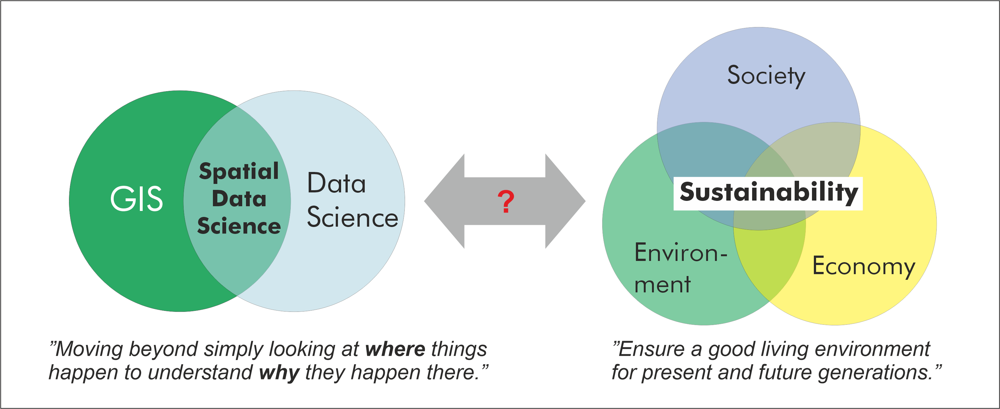

**Spatial data science for sustainable development** course introduces geographical and computational analysis approaches
to study sustainability related questions. The course is inspired by the United Nation's
`2030 Agenda for Sustainable Development <https://sdgs.un.org/goals>`__
and the `Global Sustainable Development Report <https://sustainabledevelopment.un.org/content/documents/24797GSDR_report_2019.pdf>`__,
as well as numerous scientific articles that have investigated sustainability related problems through the lense of geospatial analytics.
**Spatial data science** provides various methodologies that are useful to understand, model and quantify different
sustainability related phenomena. Both sustainability and spatial data science are enormous fields on their own,
hence it is only possible to scratch the surface of both of these worlds. The selected themes are also biased towards topics
that the authors are familiar with. Due to these reasons, unfortunately, many important topics cannot be covered during the course.
The course has been developed at the Department of Built Environment, Aalto University, Finland, and the materials are openly available for anyone interested.

After completing this course, you should:

- understand and deepen your knowledge of a range of modern spatial data science (SDS) techniques and methodologies
- be able to apply SDS methodologies in practice to a range of sustainability/global change related topics with Python programming language
- have skills and understanding how to retrieve, handle and analyze modern big geospatial data in different formats.

    Two main components of the course: Spatial Data Science & Sustainable Development.

**Prerequirements**

Before taking this course, it is required to know the basics of Python programming as well as GIS.
If you are new to Python, or would like to refresh your Python skills, we recommend to start with an online
and open access course called Geo-Python which is available at `geo-python.github.io <http://geo-python.github.io/>`__.
If you need to refresh your Python GIS skills, we recommend starting with a course `Automating GIS-processes <https://autogis.github.io/>`__
and `Spatial analytics <https://spatial-analytics.readthedocs.io/en/latest/>`__. All of these courses include tutorials, videos and exercises.

.. admonition:: Help improving the materials

    **This is version #2.**

    The course was given for the very first time in 2021. Due to the early stages of the course, it is likely that the contents will
    change and improve after each iteration (all versions will be available). By being a fully open
    educational resource, **you can also help making the course better**.
    If you find any errors, typos, or other problems, please help, by suggesting an edit in GitHub. You can do this easily by clicking
    ``suggest edit`` under the GitHub icon located at
    the top-right on each page:

    .. image:: img/suggest_edit.png
       :width: 130px

    |
    If you have good ideas about what should be taught, i.e. what methods, interesting datasets or literature should be introduced
    during the course, you can suggest and bring your ideas forward by `raising an issue in GitHub <https://github.com/AaltoGIS/Sustainability-GIS/issues/new>`__.

Course format
-------------

The majority of this course will be spent in front of a computer writing code with the Python language.
The course consists of lectures, tutorials and weekly exercises. The exercises will focus on
applying the introduced SDS methods to given sustainability related problem, and writing short essays about
the given sustainability topic introduced during each week.

Most exercises in this course involve real world examples and data. For each exercise, you may be asked to
submit the Python codes you have written, output figures and answers to related questions. You are encouraged to
discuss and work together with other students while working on the weekly exercises. The final exercise must be
completed individually and must clearly reflect your own work (in short, don’t copy paste from other students).

.. admonition:: Aalto University students

    The Spatial Data Science for Sustainable Development course is part of the
    `Master's Programme in Geoinformatics at Aalto University <https://www.aalto.fi/en/study-options/masters-programme-in-geoinformatics>`__
    under the course code ``GIS-E4040``.

.. admonition:: Interactive contents

    Each lesson in this course can be turned into an interactive programming session in the browser.
    You can find buttons for activating the python environment using `Binder <https://mybinder.readthedocs.io/en/latest/>`__ at the top of each programming lesson.
    Students at Finnish higher education institutions are encouraged to use the `CSC notebooks <https://notebooks.csc.fi/>`__ environment.

.. admonition:: Online teaching

    Please note that the course is organized completely online during the 2022 Spring semester.
    Access to zoom, slack and CSC notebooks is available to students at Finnish higher education institutes.

Program
-------

The course runs for six weeks at the Aalto University starting in the third teaching period on Monday the 10th of January 2022.
Each week covers selected spatial data science (SDS) methodologies which are applied to topics/problems relevant for selected sustainable development goals (SDG).
Topics per week are listed below. Please note that this web page is updated each week before the lesson:

.. list-table::
    :widths: 1 6 8
    :header-rows: 1
    :stub-columns: 1
    :align: left

    * - Week
      - SDS themes
      - SDG themes
    * - 1
      - - Introduction to spatial data science
        - Course practicalities
      - - Planetary boundaries, the great acceleration, anthropocene, planetary accounting etc.
        - What are Sustainable Development Goals (SDGs)? Sustainability transformations?
        - The role of SDS in sustainability science?
    * - 2
      - - Spatial network analysis
        - Spatio-temporal accessibility modelling
        - 2-step floating catchment assessment (2SFCA)
      - - SDG 3 and 10
        - Human well being and capabilities
        - Health accessibility
        - Spatial inequality
    * - 3
      - - Mobility analytics
        - Trajectory data mining
        - Spatial-interaction models
      - - SDG 11, 13: Sustainable cities and communities & Climate action
        - Transport-related carbon emission quantification
        - Commute vs long-distance travel
    * - 4
      - - Spatial regression
        - Spatial optimization - Location allocation
      - - SDG 7-8: Affordable and clean energy & Decent work and economic growth
    * - 5
      - - Agent based modelling
        - Simulation
        - Spatial risk management
      - - SDG 3: Health and well being
        - Covid-19
    * - 6
      - - Group work on selected topic
      - - Group work on selected topic

|

Contents
--------

.. toctree::
   :maxdepth: 1
   :caption: Course information

   course-info/introduction
   course-info/course-info
   course-info/grading
   course-info/course-environment-components
   course-info/slack-usage
   course-info/License-terms
   course-info/attribution
   .. course-info/pair-programming

.. toctree::
   :maxdepth: 1
   :caption: Lesson 1

   lessons/L1/lesson-overview
   lessons/L1/sustainability-intro
   lessons/L1/spatial-data-science-intro
   lessons/L1/git-basics
   lessons/L1/intro-to-python-geostack.ipynb
   lessons/L1/literature
   lessons/L1/exercise-1

.. toctree::
   :maxdepth: 1
   :caption: Lesson 2

   lessons/L2/lesson-overview
   lessons/L2/wellbeing-capabilities
   lessons/L2/network-analytics-accessibility
   lessons/L2/spatial_network_analysis.ipynb
   lessons/L2/literature
   lessons/L2/exercise-2

.. toctree::
   :maxdepth: 1
   :caption: Lesson 3

   lessons/L3/lesson-overview
   lessons/L3/mobilities
   lessons/L3/trajectory-data-mining
   lessons/L3/mobility-analytics.ipynb
   lessons/L3/literature
   lessons/L3/exercise-3.ipynb

.. toctree::
   :maxdepth: 1
   :caption: Lesson 4

   lessons/L4/lesson-overview
   lessons/L4/economy
   lessons/L4/spatial_econometrics
   lessons/L4/spatial_regression.ipynb
   lessons/L4/literature
   lessons/L4/exercise-4

.. toctree::
   :maxdepth: 1
   :caption: Lesson 5

   lessons/L5/lesson-overview
   lessons/L5/agent-based-modelling
   lessons/L5/literature
   ..    lessons/L5/exercise-5

.. toctree::
   :maxdepth: 1
   :caption: Lesson 6

   ..  lessons/L6/lesson-overview
       lessons/L6/conservation-planning-spatial-prioritization
       lessons/L6/zonation-tutorial
       lessons/L6/literature

.. toctree::
   :maxdepth: 1
   :caption: Final Assignment

   lessons/final-assignment/final-assignment
   lessons/final-assignment/final-assignment-grading