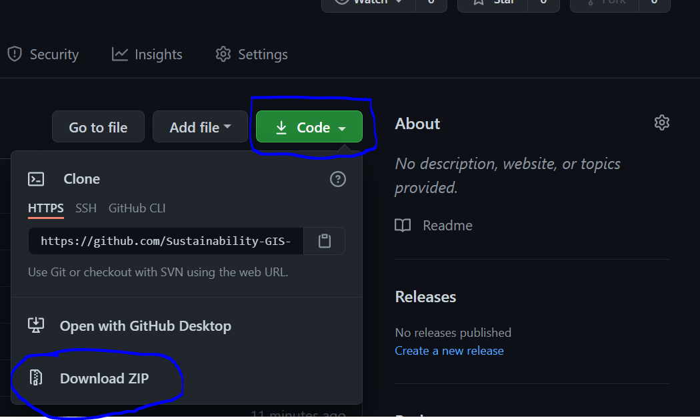

Tutorial/Exercise 6 - Spatial prioritization with Zonation
==========================================================

For this week, the Exercise will be combined with the tutorial. This week, we will use the Zonation software to do the exercises.
Hence, **you need to install the software** to your local computer before starting the tutorial/exercise. We recommend, that you
do the installations already before the lecture on Monday.

Install Zonation
----------------

Zonation 5 is available for Windows and Linux. Please follow the installation instructions

.. admonition:: Install Zonation for Windows
    :class: dropdown, note

    To be able to install Zonation, you need to have admin rights to your computer. Contact us via Slack,
    if you do not have access to a computer with rights to do installations. To install the software, do following steps:

    1. `Download Zonation <https://github.com/AaltoGIS/GIS-docker-environment/raw/master/sds-sustainability/zonation/z5setup.exe>`__ which is a single executable file including the software.
    2. Move the software (Z5setup.exe) somewhere where you have the course Exercises, so it's easy to find later on.
    3. Follow the steps in this presentation:

    .. raw:: html

        <iframe src="https://docs.google.com/presentation/d/e/2PACX-1vRnjmReLXe-YZhUslf3XVyYqc85-3Ypq9ceQV74BXWwSEy57VKVVgs4NvqdA_lacaJmCoUfRWAOSmn1/embed?start=false&loop=false&delayms=3000" frameborder="0" width="480" height="299" allowfullscreen="true" mozallowfullscreen="true" webkitallowfullscreen="true"></iframe>

.. admonition:: Install Zonation for Linux
    :class: dropdown, note

    To be able to install Zonation, you need to have admin rights to your computer. Contact us via Slack,
    if you do not have access to a computer with rights to do installations. To install the software, do following steps:

    1. `Download Zonation <https://github.com/AaltoGIS/GIS-docker-environment/raw/master/sds-sustainability/zonation/z5.AppImage>`__ which is a single executable file including the software:

    .. figure:: img/z5_Appimage_downloaded.png
        :widht: 300px

    2. Move the software (Z5.AppImage) somewhere where you have the course Exercises, so it's easy to find later on.
    3. Right click the software icon and choose ``Properties``.
    4. Under the ``Permissions`` tab, put a tick into the box that says ``Allow executing file as program``:

    .. figure:: img/give_execution_permissions.png
        :widht: 300px

    5. Exit the properties and double-click the Z5.AppImage. If everything works correctly, you should have Zonation running:

    .. figure:: img/running_zonation_on_Linux.png
        :widht: 300px

Get your copy of the Tutorial/Exercise materials
------------------------------------------------

In a similar manner as in the previous weeks, you will have your copy of the tutorial/exercise materials.
**Start the tutorial by accepting this GitHub Classroom**: `Exercise 6 <https://classroom.github.com/a/PYo5waSs>`__.
After you have created your own copy of the exercise materials **download / clone them** to your own computer:

- In case you have Git installed locally, you can clone the repository from terminal/command prompt using Git (``git clone <URL-address>``)
- If you don't have Git, you can download the materials directly from GitHub as a Zip file by pressing the **Code** button on the GitHub repository and choosing Download Zip:

Tutorial instructions
---------------------

.. raw:: html

    <iframe src="https://docs.google.com/presentation/d/e/2PACX-1vQeOAa31z_xUsGOMVEyyU-hyx82KWKxt8LN6xHVKiAxIcsgVFdzDyQNAAEBi5Z5MBwHo0_FF5IA5wRX/embed?start=false&loop=false&delayms=3000" frameborder="0" width="720" height="400" allowfullscreen="true" mozallowfullscreen="true" webkitallowfullscreen="true"></iframe>

