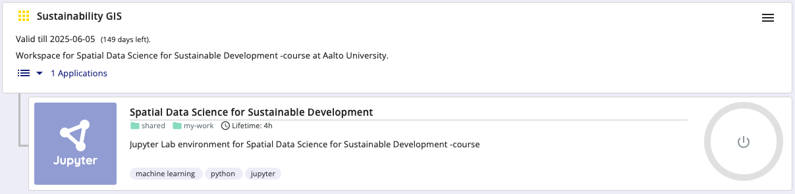

Tutorial 0: Meeting Git and Noppe
=================================

This tutorial covers the very basics of version control using **Git/GitHub** and the **Noppe** cloud computing environment that we use for programming on this course.
After this tutorial you should be able to start working on the programming Exercises in Noppe. In the basic workflow, you will repeat the following steps:

1. `Start Noppe computing instance`_
2. `Clone your personal Exercise repository from GitHub`_
3. `Add changes`_
4. `Commit changes`_
5. `Push changes to your personal Exercise repository in GitHub`_

The following tutorial will teach you step-by-step how you can start working on the Exercises using the CSC Noppe cloud computing environment.

Key concepts
------------

Version control
~~~~~~~~~~~~~~~

We use Git to record changes to our files over time (hence, the name *version control*), and for communicating between the local repository on our computer and the remote repository on GitHub.
A "repository", or a "Git project", or a "repo", is a location for storing files. A repo contains all the files and folders associated with a project and the revision history of each entity.
In general, it is recommended that each project, library or discrete piece of software should have it's own repository.
In this course each exercise has it's own repository on GitHub.

During this course, we often start by cloning an existing repository from GitHub
to our cloud computer (or own computer) using ``git clone``. Using ``git pull`` we can fetch (and merge) new changes from GitHub,
and ``git push`` publishes our local changes to GitHub. Read more about sharing and updating
Git projects `in here <https://git-scm.com/book/en/v2/Appendix-C:-Git-Commands-Sharing-and-Updating-Projects>`__.

    Update your Git project using the pull and push commands. Always pull before you push (especially when working in a shared project)!

Version control history consists of snapshots of all the files in our project.
In order record changes to our files, we first add changes to a so called staging area (using ``git add``). The idea is, that you can have a (sometimes messy) working directory, and by using ``git add`` you tell
Git which files to include in the next committed snapshot. Finally, ``git commit`` records a permanent snapshot of the staged changes. Read more about basic snapshotting `in here <https://git-scm.com/book/en/v2/Appendix-C:-Git-Commands-Basic-Snapshotting>`__.

    Version control steps using Git (adapted from `Git documentation <https://git-scm.com/about/staging-area>`__).

Cloud computing
~~~~~~~~~~~~~~~

We will use a cloud-based computing environment called ``CSC Noppe`` to access interactive online version of the lessons
and to work on the weekly exercises. You can use the cloud computing environment with any computer as long as it has a reasonably fast internet
connection and a web browser (just don't use Internet Explorer).

Please note that the cloud computing environments are **temporary** and they will be removed after the course.
Always remember to push your changes to GitHub (and / or download a local copy).

.. figure:: img/launch-buttons.png
   :alt: Launch buttons
   :width: 700px

   Different options for making the lesson interactive

Each interactive lesson and exercise will have a launch button for CSC Noppe.
The CSC Noppe environment is only accessible to students from Finnish universities and research institutes.

.. note::

    You can also install Python and the same programming environment to your local computer, but it is not necessary in this course (we recommend using the cloud computing environment.
    **However**, if you wish to do so, please read :doc:`this documentation <course-info/installing-miniconda>` to learn how to install Python and the libraries on your own computer.

Preparations
------------

These preparatory steps **only needs to be done once at the beginning of the course**:

1. Join the CSC Noppe workspace of the course
~~~~~~~~~~~~~~~~~~~~~~~~~~~~~~~~~~~~~~~~~~~~~

Noppe by CSC (https://noppe.csc.fi) is a computing environment hosted by the Finnish IT Center for Science (CSC). CSC Noppe is used for running Jupyter Notebooks in a customized cloud computing environment.
CSC Noppe is available only for students who are affiliated with Finnish universities and research institutes (via the HAKA user authentication).

.. note:: **When using the CSC Notebooks for the first time, you need to join the group created for this course:**

    1. Log in at https://noppe.csc.fi/
    2. Select Haka for the authentication provider
    3. Enter your Finnish university login credentials
    4. Click on the **Join workspace** button on the top right
    5. Join the ``Sustainability GIS`` workspace using the join code ``sus-qf2quq8d``

After joining the group, you should be able to view an environment called ``Sustainability GIS`` on the Dashboard:

2. Create a Personal Access Token
~~~~~~~~~~~~~~~~~~~~~~~~~~~~~~~~~

Before we can clone a repository from GitHub, we need to create a Personal Access Token for us to be able to interact with GitHub. We will go through the basic setup here, you can also find more detailed instructions in the `GitHub documentation <https://docs.github.com/en/github/authenticating-to-github/keeping-your-account-and-data-secure/creating-a-personal-access-token>`_.

1. If you have not already verified your email address, make sure to do so in your GitHub-settings (`GitHub email verification <https://docs.github.com/en/get-started/signing-up-for-github/verifying-your-email-address>`_).
   On GitHub, go into `your settings <https://github.com/settings/profile>`__ which you can find from the panel that opens by clicking your profile picture on the top-right of the page:

2. Go to the `developer settings <https://github.com/settings/apps>`__ which is located at the bottom of the left sidebar:

.. image:: img/GH_developer_settings.jpeg
    :width: 200

3. Then click **Tokens (classic)** on **Personal access tokens** menu:

.. image:: img/GH_personal_access_token.jpeg
    :width: 400

4. Then we will create the token by clicking on **Generate new token (classic)**.

5. In case Github wants to confirm access, **Use your password** (or Github Mobile if you have it configured) to continue:

6. Give your token 1) a **Name**, 2) **Expiration date** (90 Days), and 3) select the appropriate scope by clicking the **repo**:

7. Then we can click the **Generate token** button at the very bottom of the page to create and see our token:

8. We are then presented with our Personal access token. **This is only shown once!** Thus be sure to store this token somewhere safe. Do e.g. following:

- **Click the copy button** to copy it to your clipboard and
- **Create a new text-file** somewhere safe on your computer,
- **Paste the code into a text file** (alternatively you can store the token into a password manager if you use one).

After these preparatory steps, we can actually start working on the exercises in CSC Noppe environment, which we will introduce next.

Start Noppe computing instance
------------------------------

Whenever you want to do programming on this course, the following steps need to be taken:

.. note:: **Repeat these steps every time when starting to work on a programming task using the CSC Noppe:**

    1. Log in at https://noppe.csc.fi/
    2. Click ``Start session`` (power button) on the Dashboard for ``Spatial Data Science for Sustainable Development``
    3. Wait. It might take a few moments for the instance to launch

   Launching the instance takes a few moments.

After these steps, you should have JupyterLab IDE running on your browser and you can start programming with it!

Start working on the Exercise
-----------------------------

The following demonstrates how to start working on a programming exercise using CSC Noppe:

Start your exercise assignment
~~~~~~~~~~~~~~~~~~~~~~~~~~~~~~

As a very first thing, **you always need to start your Exercise assignment by creating your personal exercise repository**.
You can do this by clicking the link on our dedicated website for different exercises, such as:

- `Exercise 1 <https://sustainability-gis.readthedocs.io/en/latest/exercises/exercise-1.html>`__

Clone your personal Exercise repository from GitHub
~~~~~~~~~~~~~~~~~~~~~~~~~~~~~~~~~~~~~~~~~~~~~~~~~~~

When you start working on a given Exercise, the first thing we need is the URL of your exercise repository from GitHub.
**Go to** https://github.com/Sustainability-GIS-2025/ **and navigate to your personal Exercise-1 repository** (e.g. ``exercise-1-HTenkanen``)

On GitHub, find the button **Code** and copy the url under **Clone with HTTPS**.

The URL looks something like this:
https://github.com/Sustainability-GIS-2025/exercise-1-HTenkanen.git but with your own username.

During this course, we will most often start working with the exercises using an existing repository from GitHub.
In order to get a copy of the exercise repository on our own computer (or the cloud computer), we need to ``clone`` it.

Navigate to the **my-work** folder in JupyterLab and activate the git-plugin. The plugin will tell you that **my-work**
is not a Git repository and gives you some options.

In our case, we want to **Clone a Repository**:

Go ahead and paste your exercise repository URL into the pop-up window:

On the command line this action is equivalent to the ``git clone`` command.

.. note::

    **Pay attention to which folder you are in!** Git will create a new folder under the folder you
    are located in when cloning a repo.

Credentials
~~~~~~~~~~~

Git needs to know who you are in order to give you access to remote repositories.

**Insert your GitHub username and personal access token**:

Now you should see a new folder in JupyterLab that is identical to the repository on GitHub.

On the command line, credentials can be managed using ``git config``.

Git status
~~~~~~~~~~~~~~

Navigate to the new folder in JupyterLab and activate the Git plugin. You should now see some basic info about your repository:

On the command line ``git status`` shows the status of the repository.

Add changes
~~~~~~~~~~~~~~

Let's start making changes in the repository! Open the ``README.md`` -file and make some edits. For example, add some text at the end of the file:

    Edit a file in JupyterLab

After saving your changes, check the status of the repository. You should see ``README.md`` listed under **Changed** files:

    Changes visible in the Git plugin

These changes are not yet "staged for commit", which means that we need to add them first to the staging area if we want to make a permanent snapshot of these changes.

After adding the changes, you should see the changed file under **Staged** in the Git plugin.

Note that you can also **unstage** and **discard changes** using the plugin.
For now, we are happy with the changes made, and are ready to commit them.

On the command line, ``git add``  is the command for adding changes to the staging area.

Commit changes
~~~~~~~~~~~~~~

Once the changed files are in the staging area, we can create a permanent snapshot by committing the changes.
Always remember to write an informative commit message to accompany your changes:

Once you hit the commit-button, the plugin will most likely ask your name and email.

You can insert the same details you used when signing up to GitHub.

Once the commit succeeds, you should see the latest set of changes under the History-tab in the Git-plugin:

*Note: You might also see some previous changes by the course instructors. These changes have been generated automatically and you can ignore them.*

On the command line the syntax for committing is ``git commit -m "commit message"``. After committing, it is good practice to check the repository status using ``git status``.

.. note::

    We can **tell Git to remember our GitHub username and access token** to avoid typing them in all the time. Open up a Terminal window and type in this command:

    ``git config --global credential.helper 'store --file /home/jovyan/work/.git-credentials'``

    Then change the folder you are in by typing (with your username):

    ``cd exercise/excercise-1-HTenkanen/``

    We then pull from our GitHub repository:

    ``git pull``

    Type your username, press enter, and go to the text file with your access token, copy it, and paste into your terminal with **ctrl+v** and press enter. Then your username and access token should be stored and you can pull and push to and from GitHub without having to type your access token every time.

Push changes to your personal Exercise repository in GitHub
~~~~~~~~~~~~~~~~~~~~~~~~~~~~~~~~~~~~~~~~~~~~~~~~~~~~~~~~~~~
Next, we want to synchronize our local changes with the remote repository on GitHub.

    Buttons for Pulling and Pushing changes between the local and remote repositories

First, it's good to use :code:`git pull` (button with arrow down) to double check for remote changes before contributing your own changes.
Unless you cached your credentials, Git will once more prompt you for username and password at this point.

In this case, the repository is probably up-to-date and no new changes are downloaded. However, it is good practice to always use Git Pull before publishing your local changes in case someone made changes in the remote repository in the meanwhile!

Now we are ready to push the local changes to GitHub using :code:`git push` (button with arrow up):

.. figure:: img/git-plugin-push-ok.webp

Now you should see the updates in GitHub! Go and have a look at your personal repository in https://github.com/Sustainability-GIS-2025/ .

On the command line, ``git pull`` fetches and merges changes from the remote repository, and ``git pull`` publishes local changes.

That's all you need to know about Git for now :)

Git from the command line
--------------------------
There are many different ways of using Git, and you might want to try out using Git from the command line at some point.

Terminal
~~~~~~~~~~

.. note::
    You will need to know a couple of basic command line commands in order to use Git from the command line. Code Academy's `list of command line commands <https://www.codecademy.com/articles/command-line-commands>`__ provides
    a good overview of commonly used commands for navigating trough files on the command line. For using Git on the command line, you should at least be familiar with these commands:

    - ``ls`` - list contents of the current directory
    - ``ls -a`` - list contents of the current directory including hidden files
    - ``cd`` - change directory. For example, ``cd exercises``
    - ``cd ..`` - move one directory up

**Start a new Terminal session in JupyterLab** using the icon on the Launcher, or from *File* > *New* > *Terminal*.

**Check if you have git installed** by typing :code:`git --version` in the terminal window:

.. code-block:: bash

    git --version

Anything above version 2 is just fine.

.. note::

    You can paste text on the terminal using :code:`Ctrl + V` or :code:`Shift + Right Click --> paste`

Configuring Git credentials
~~~~~~~~~~~~~~~~~~~~~~~~~~~

Configure Git to remember your identity using the ``git config`` tools. You (hopefully) only need to do this once
if working on your own computer, or on a cloud computer with persistent storage on CSC notebooks.

.. code-block:: bash

    git config --global user.name "[firstname lastname]"
    git config --global user.email "[email@example.com]"

Basic commands
~~~~~~~~~~~~~~
The basic workflow of cloning a repository, adding changes to the staging area, committing and pushing the changes can be completed using these command line commands:

- ``git clone [url]`` - retrieve a repository from a remote location (often from GitHub)
- ``git status``- review the status of your repository (use this command often!)
- ``git add [file]`` - add files to the next commit (add files to the staging area)
- ``git commit -m "[descriptive message]"`` - commit staged files as a new snapshot
- ``git pull`` - bring the local branch up to date (fetch and merge changes from the remote)
- ``git push`` - transmit local branch commits to the remote repository

.. note::

    Remember to use ``git status`` often to check the status of our repository.

.. admonition:: Other useful Git commands

    Check out other commonly used git commands from `the GIT CHEAT SHEET <https://education.github.com/git-cheat-sheet-education.pdf>`__

.. admonition:: Remote repository

    Remote repositories are versions of your project that are hosted on a network location (such as GitHub).
    When we cloned the repository using ``git clone``, Git automatically started tracking the remote repository from where we cloned the project.
    You can use the ``git remote -v`` command to double check which remote your repository is tracking.

    **A common mistake during this course is that you have accidentally cloned the template repository in stead of your own/your teams repository.**

    You can read more about managing remotes `in here <https://git-scm.com/book/en/v2/Git-Basics-Working-with-Remotes>`__.

.. admonition:: Master branch

    **Branches and branching** are powerful features in Git that allow maintaining parallel versions of the same project.
    During this course you don't need to worry too much about branches. However, it is good to understand that **we are working on the master branch of our repository**. For example, when using the ``git push`` command,
    the full syntax is ``git push origin master`` which means that we are pushing the changes to the master branch of the remote repository called origin. Read more about git branches `in here <https://git-scm.com/docs/git-branch>`__.

Resolving conflicts
-------------------

It is possible that you will encounter a **merge conflict** at some point of this course. A merge conflict might happen if two users have edited the same content, or if you
yourself have edited the same content both on GitHub and locally without properly synchronizing the changes. In short, Git will tell you if it is not able to sort out the version history of your project by announcing a merge conflict.

We won't cover how to solve merge conflicts in detail during the lessons. You can read more about `how to resolve merge conflicts from the Git documentation <https://git-scm.com/docs/git-merge#_how_to_resolve_conflicts>`__.
**The best thing to do to avoid merge conflicts is to always Pull before you Push new changes.**
In case you encounter a merge conflict, don't panic! Read carefully the message related to the merge conflict, and try searching for a solution online and ask for help on Slack.

Remember that you can always download your files on your own computer, and upload them manually to GitHub like we did in Exercise 1!

.. figure:: https://imgs.xkcd.com/comics/git.png
    :alt: https://xkcd.com/1597/

    Source: https://xkcd.com/1597/

